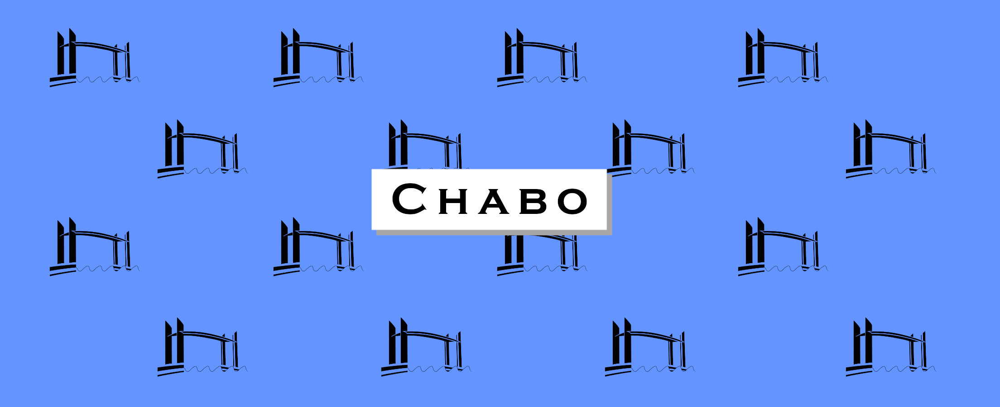

<p align="center">
  <a href="https://go.dev"></a> 
  <a href="https://github.com/vareversat/chabo-api/actions"></a>
  <a href="https://github.com/vareversat/chabo-api/releases"></a>
  <a href="https://codecov.io/gh/vareversat/chabo-api/"></a>
</p>

# Chabo API

**The place to get the Chaban Delmas event schedules !**
This REST API is entended to improve the already existing Open Data API provided by Bordeaux Métropole available [here](https://opendata.bordeaux-metropole.fr/explore/dataset/previsions_pont_chaban/information/).

## Overview

This API allows you to get the schedules you want by filtering over the type of closing, the closing date or even the boat maneuver. You can also specify the timezone you want on you queries

## Installation / Run

On you computer, you'll need to download these softwares :

- Docker
- VS Code (with devcontainer extension)

And exec this steps

```bash
git clone https://github.com/vareversat/chabo-api.git
```

Open the project into VSCode via devcontainer

Once the container is UP and you opened a new terminal, run `make run` and ta-dam ! The Swagger is running on <http://localhost:8080/swagger/index.html>


You can also these usefull commands :

```bash
make test       # Run all tests
make coverage   # Run all tests with coverage
make clean      # Clean all generated binaries
```

... and many more. Take a look at the [Makefile](Makefile) if you want !
